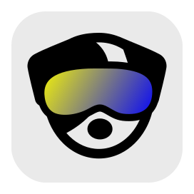

<p align="center">
  <a href="https://dogvision.vercel.app" target="_blank"></a>
</p>
<hr/>

## Requirements

- [Node.js](https://nodejs.org/en/) >=18

## Development

1. Install project dependencies:
   ```
   pnpm i
   ```
2. Run the application in the development mode:
   ```
   pnpm run dev
   ```

## Deployment

#### Using providers with SvelteKit support

1. Deploy the application using the provider of your preference with SvelteKit support.
2. Provide required environment variables based on the `.env.example` file.

#### Self-hosting

1. Set up required environment variables based on the `.env.example` file.
2. Follow the SvelteKit's [node server deployment documentation](https://kit.svelte.dev/docs/adapter-node).

## Acknowledgements

The color model has been inspired by [András Péter's Dog Vision](https://dog-vision.andraspeter.com/) project.
